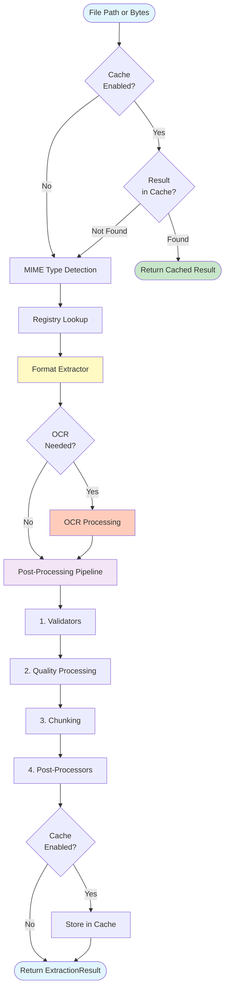
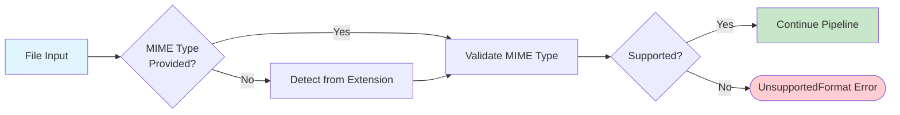
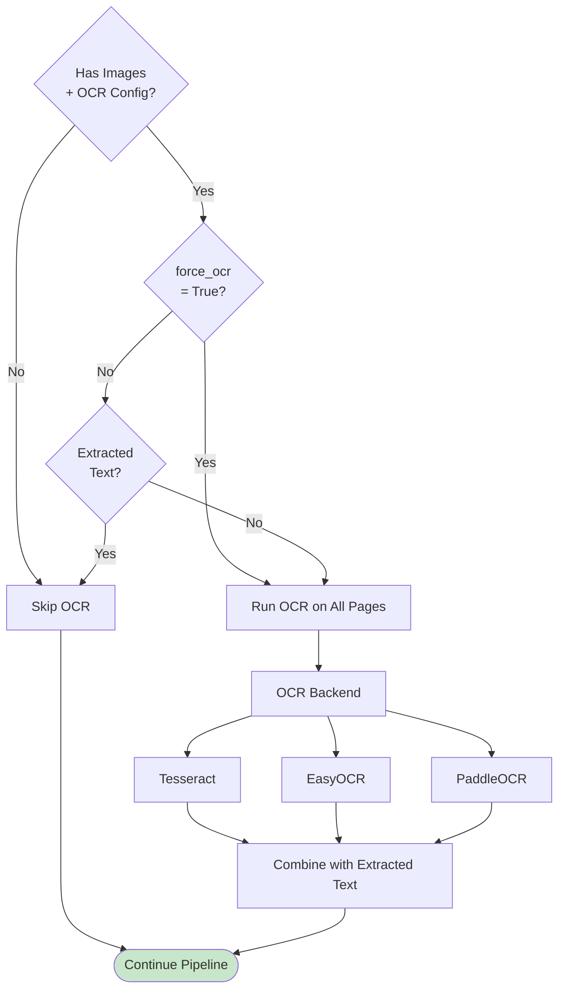

# Extraction Pipeline

The extraction pipeline is the core workflow that transforms raw files into structured, processed content. Understanding this pipeline is essential for effectively using Kreuzberg and building custom extractors or processors.

## Pipeline Overview

Every extraction request flows through the same multi-stage pipeline, regardless of file format or configuration:



## Stage Details

### 1. Cache Check

If caching is enabled (`cache=True` in `ExtractionConfig`), Kreuzberg first checks for a cached result:

- **Cache Key**: Generated from file path/bytes + configuration hash
- **Cache Hit**: Returns cached `ExtractionResult` immediately (bypasses all processing)
- **Cache Miss**: Proceeds to MIME detection

Caching significantly improves performance for repeated extractions of the same file.

### 2. MIME Type Detection

MIME types determine which extractor handles the file. Detection happens in two ways:

- **Explicit**: If `mime_type` parameter is provided, validates it's supported
- **Automatic**: Detects MIME type from file extension using internal mapping (118+ extensions)



Common MIME types include:

- PDFs: `application/pdf`
- Images: `image/jpeg`, `image/png`, etc.
- Office: `application/vnd.openxmlformats-officedocument.wordprocessingml.document` (DOCX)
- Text: `text/plain`, `text/markdown`, `application/xml`

See the [Configuration Guide](../guides/configuration.md) for MIME type configuration details.

### 3. Registry Lookup

The extractor registry maps MIME types to `DocumentExtractor` implementations:

```rust
// Registry maintains: MIME type → Extractor mapping
let registry = get_document_extractor_registry();
let extractor = registry.get("application/pdf")?;
```

If multiple extractors support the same MIME type, priority determines selection (higher priority wins).

### 4. Format Extraction

The selected extractor processes the file using format-specific logic:

- **PDF**: Extracts text using pdfium-render, optionally extracts images for OCR
- **Excel**: Parses sheets with calamine, converts to structured tables
- **Images**: Loads image data, routes to OCR backend
- **XML/Text**: Streaming parser for memory efficiency
- **Email**: Parses MIME structure, extracts body and attachments
- **Office**: Extracts from DOCX/PPTX using format libraries

Each extractor returns an `ExtractionResult` containing:

- `content`: Extracted text
- `metadata`: File metadata (format-specific)
- `page_count`, `language`, etc.

### 5. OCR Processing (Optional)

If the file contains images and OCR is enabled, Kreuzberg processes images through the configured OCR backend:



OCR configuration controls:

- **Backend selection**: Tesseract (default), EasyOCR, PaddleOCR
- **Language**: OCR language models to use
- **force_ocr**: Always run OCR even if text exists
- **Caching**: OCR results cached separately for performance

### 6. Post-Processing Pipeline

After extraction, results pass through a configurable post-processing pipeline:

#### 6.1 Validators

Validators run first and can fail-fast if results don't meet requirements:

```python
# Example: Minimum text length validator
class MinLengthValidator:
    def validate(self, result: ExtractionResult, config: ExtractionConfig) -> None:
        if len(result.content) < 100:
            raise ValidationError("Extracted text too short")
```

Validator errors bubble up immediately and stop processing.

#### 6.2 Quality Processing

If `enable_quality_processing=True`, Kreuzberg calculates a quality score based on:

- Text/non-text character ratio
- Word frequency distribution
- Formatting artifacts (repeated characters, etc.)
- Metadata consistency

Quality score added to `metadata.additional["quality_score"]`.

#### 6.3 Chunking

If `chunking` config is provided, text is split into overlapping chunks:

```python
config = ExtractionConfig(
    chunking=ChunkingConfig(
        max_chars=1000,
        max_overlap=100
    )
)
```

Chunks added to `result.chunks` with start/end offsets.

#### 6.4 Post-Processors

Post-processors run in order by stage (Early → Middle → Late):

```python
# Example: Custom post-processor
class RedactionProcessor:
    def process(self, result: ExtractionResult, config: ExtractionConfig) -> ExtractionResult:
        result.content = result.content.replace("[REDACTED]", "***")
        return result
```

Post-processor errors are logged but don't stop the pipeline.

### 7. Cache Storage

If caching is enabled and extraction succeeded, the result is stored in cache for future requests.

### 8. Result Return

The final `ExtractionResult` is returned to the caller with:

- Extracted and processed content
- Complete metadata
- Optional chunks and embeddings
- Processing history

## Performance Optimizations

The pipeline includes several optimizations:

1. **Early cache returns**: Cached results skip all processing
2. **Lazy OCR**: Only runs when necessary (no text or `force_ocr`)
3. **Streaming parsers**: XML and text files stream instead of loading into memory
4. **Concurrent batch extraction**: Multiple files processed in parallel
5. **Global Tokio runtime**: Shared async runtime eliminates initialization overhead

## Error Handling

Errors at different stages are handled differently:

- **Validation errors**: Fail immediately (invalid file path, unsupported format)
- **Extraction errors**: Bubble up as `ParsingError` (corrupted file, format-specific issues)
- **System errors**: Always bubble up (OSError, RuntimeError, MemoryError)
- **Post-processor errors**: Logged but don't fail extraction

See [Error Handling](../reference/errors.md) for complete error documentation.

## Related Documentation

- [Architecture](architecture.md) - Overall system design
- [Configuration Guide](../guides/configuration.md) - How to configure the pipeline
- [OCR Guide](../guides/ocr.md) - Detailed OCR configuration
- [Creating Plugins](../guides/plugins.md) - How to build custom extractors and processors
