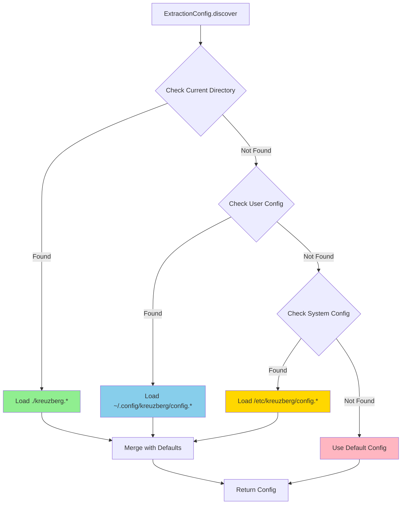

# Configuration Guide

For complete configuration field documentation, see [Configuration Reference](../reference/configuration.md).

Kreuzberg's behavior is controlled through configuration objects. All settings are optional with sensible defaults, allowing you to configure only what you need.

## Configuration Discovery

Kreuzberg automatically discovers configuration files in these locations (in order):

1. Current directory: `./kreuzberg.{toml,yaml,yml,json}`
2. User config: `~/.config/kreuzberg/config.{toml,yaml,yml,json}`
3. System config: `/etc/kreuzberg/config.{toml,yaml,yml,json}`

Once found, configuration is merged with defaults. No configuration file is required—if none is found, defaults are used.

## Quick Start

### Configuration Methods

Kreuzberg supports four ways to configure extraction:

=== "C#"

    --8<-- "snippets/csharp/config_discover.md"

=== "Go"

    --8<-- "snippets/go/config/config_discover.md"

=== "Java"

    --8<-- "snippets/java/config/config_discover.md"

=== "Python"

    --8<-- "snippets/python/config/config_discover.md"

=== "Ruby"

    --8<-- "snippets/ruby/config/config_discover.md"

=== "Rust"

    --8<-- "snippets/rust/config/config_discover.md"

=== "TypeScript"

    --8<-- "snippets/typescript/config/config_discover.md"

=== "WASM"

    --8<-- "snippets/wasm/config/config_discover.md"

=== "TOML File"

    ```toml title="kreuzberg.toml"
    use_cache = true
    enable_quality_processing = true

    [ocr]
    backend = "tesseract"
    language = "eng"

    [ocr.tesseract_config]
    psm = 3
    ```

=== "YAML File"

    ```yaml
    # kreuzberg.yaml
    use_cache: true
    enable_quality_processing: true

    ocr:
      backend: tesseract
      language: eng
      tesseract_config:
        psm: 3
    ```

=== "JSON File"

    ```json
    {
      "use_cache": true,
      "enable_quality_processing": true,
      "ocr": {
        "backend": "tesseract",
        "language": "eng",
        "tesseract_config": {
          "psm": 3
        }
      }
    }
    ```

### Configuration Discovery



Kreuzberg automatically discovers configuration files in the following locations (in order):

1. Current directory: `./kreuzberg.{toml,yaml,yml,json}`
2. User config: `~/.config/kreuzberg/config.{toml,yaml,yml,json}`
3. System config: `/etc/kreuzberg/config.{toml,yaml,yml,json}`

=== "C#"

    --8<-- "snippets/csharp/config_discover.md"

=== "Go"

    --8<-- "snippets/go/config/config_discover.md"

=== "Java"

    --8<-- "snippets/java/config/config_discover.md"

=== "Python"

    --8<-- "snippets/python/config/config_discover.md"

=== "Ruby"

    --8<-- "snippets/ruby/config/config_discover.md"

=== "Rust"

    --8<-- "snippets/rust/config/config_discover.md"

=== "TypeScript"

    --8<-- "snippets/typescript/config/config_discover.md"

=== "WASM"

    --8<-- "snippets/wasm/config/config_discover.md"

## Common Use Cases

### Basic Configuration

Get started with minimal configuration:

=== "C#"

    --8<-- "snippets/csharp/config_basic.md"

=== "Go"

    --8<-- "snippets/go/config/config_basic.md"

=== "Java"

    --8<-- "snippets/java/config/config_basic.md"

=== "Python"

    --8<-- "snippets/python/config/config_basic.md"

=== "Ruby"

    --8<-- "snippets/ruby/config/config_basic.md"

=== "Rust"

    --8<-- "snippets/rust/config/config_basic.md"

=== "TypeScript"

    --8<-- "snippets/typescript/config/config_basic.md"

### Setting Up OCR

Enable OCR for scanned documents and images:

=== "C#"

    --8<-- "snippets/csharp/config_ocr.md"

=== "Go"

    --8<-- "snippets/go/config/config_ocr.md"

=== "Java"

    --8<-- "snippets/java/config/config_ocr.md"

=== "Python"

    --8<-- "snippets/python/config/config_ocr.md"

=== "Ruby"

    --8<-- "snippets/ruby/config/config_ocr.md"

=== "Rust"

    --8<-- "snippets/rust/ocr/config_ocr.md"

=== "TypeScript"

    --8<-- "snippets/typescript/config/config_ocr.md"

For more OCR options, see [Tesseract Configuration](../reference/configuration.md#tesseractconfig) in the reference.

### Chunking for RAG

Configure text chunking for vector database ingestion:

=== "C#"

    --8<-- "snippets/csharp/advanced/embedding_with_chunking.md"

=== "Go"

    --8<-- "snippets/go/utils/chunking.md"

=== "Java"

    --8<-- "snippets/java/utils/chunking.md"

=== "Python"

    --8<-- "snippets/python/utils/chunking.md"

=== "Ruby"

    --8<-- "snippets/ruby/utils/chunking.md"

=== "Rust"

    --8<-- "snippets/rust/advanced/chunking.md"

=== "TypeScript"

    --8<-- "snippets/typescript/utils/chunking.md"

### File Format Examples

#### TOML (Recommended)

```toml title="kreuzberg.toml"
use_cache = true
enable_quality_processing = true

[ocr]
backend = "tesseract"
language = "eng"

[ocr.tesseract_config]
psm = 3
```

#### YAML

```yaml title="kreuzberg.yaml"
use_cache: true
enable_quality_processing: true

ocr:
  backend: tesseract
  language: eng
  tesseract_config:
    psm: 3
```

#### JSON

```json title="kreuzberg.json"
{
  "use_cache": true,
  "enable_quality_processing": true,
  "ocr": {
    "backend": "tesseract",
    "language": "eng",
    "tesseract_config": {
      "psm": 3
    }
  }
}
```

## Configuration Field Reference

For complete documentation of all configuration fields, see [Configuration Reference](../reference/configuration.md).

Key sections include:
- [ExtractionConfig](../reference/configuration.md#extractionconfig) - Main configuration
- [OcrConfig](../reference/configuration.md#ocrconfig) - OCR options
- [TesseractConfig](../reference/configuration.md#tesseractconfig) - Fine-grained OCR tuning
- [ChunkingConfig](../reference/configuration.md#chunkingconfig) - Text chunking
- [TokenReductionConfig](../reference/configuration.md#tokenreductionconfig) - Token optimization
- [PageConfig](../reference/configuration.md#pageconfig) - Page tracking
- [All other configs](../reference/configuration.md#configuration-field-reference) - Complete field list
