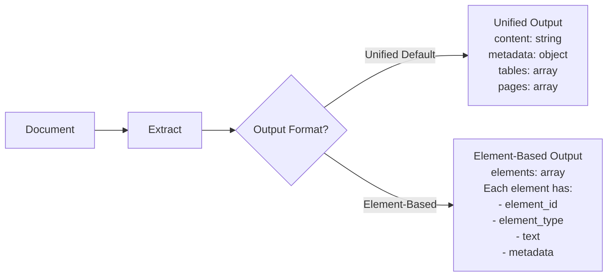

# Element-Based Output

## Overview

Kreuzberg supports **element-based output**, an optional output format that segments documents into semantic elements (titles, paragraphs, lists, tables, etc.). This format is compatible with Unstructured.io's element-based structure, making migration straightforward.

### When to Use Element-Based Output

**Use element-based output** when you need:

- Fine-grained semantic segmentation of documents
- Compatibility with Unstructured.io workflows
- Element-level metadata (bounding boxes, page numbers, coordinates)
- Semantic search or retrieval over document segments
- Processing pipelines that operate on document elements

**Use unified output (default)** when you need:

- Complete document text in a single field
- Simpler processing workflows
- Maximum extraction performance
- Rich document-level metadata
- Per-page content extraction



### Compatibility with Unstructured.io

Element-based output is designed for compatibility with Unstructured.io, with some enhancements:

| Aspect | Unstructured | Kreuzberg | Notes |
|--------|--------------|-----------|-------|
| **Output Structure** | Array of elements | `elements` field in result | Kreuzberg also includes other fields |
| **Element Types** | PascalCase strings | snake_case strings | `Title` → `title`, `NarrativeText` → `narrative_text` |
| **Metadata** | Basic (page_number, filename) | Rich (coordinates, hierarchy, format-specific) | Kreuzberg includes bounding boxes from PDF |
| **Element IDs** | Not always present | Always present | Deterministic hash-based IDs |
| **Compatibility Mode** | N/A | Set `output_format=element_based` | Element array structure matches Unstructured |

## Element Types Reference

Kreuzberg supports 11 element types. Each element type represents a specific semantic component of a document.

### Title

Document titles and headings with optional hierarchy metadata.

**Characteristics**:
- Headings (H1-H6 from PDF hierarchy or HTML)
- Document titles
- Section headings
- Includes `level` metadata (`h1` through `h6`) when available

**Example**:
```json
{
  "element_id": "elem-a3f2b1c4",
  "element_type": "title",
  "text": "Introduction to Machine Learning",
  "metadata": {
    "page_number": 1,
    "element_index": 0,
    "additional": {
      "level": "h1",
      "font_size": "24.0"
    }
  }
}
```

### NarrativeText

Paragraphs and narrative text blocks.

**Characteristics**:
- Paragraph text
- Body content
- Prose text blocks
- Split on double newlines or paragraph boundaries

**Example**:
```json
{
  "element_id": "elem-f9c8a2e1",
  "element_type": "narrative_text",
  "text": "Machine learning is a subset of artificial intelligence that focuses on...",
  "metadata": {
    "page_number": 1,
    "element_index": 3
  }
}
```

### ListItem

Individual list items (bullets, numbered, lettered, or indented).

**Characteristics**:
- Bullet list items (`•`, `-`, `*`)
- Numbered list items (`1.`, `2.`, etc.)
- Lettered list items (`a.`, `b.`, `A.`, `B.`)
- Indented list items (detected by leading whitespace)
- Each list item is a separate element

**Metadata fields**:
- `list_type`: `bullet`, `numbered`, `lettered`, `indented`
- `list_marker`: The actual marker used (e.g., `"1."`, `"•"`, `"a."`)
- `indent_level`: Indentation depth (0-based)

**Example**:
```json
{
  "element_id": "elem-d4b7f3a9",
  "element_type": "list_item",
  "text": "Supervised learning uses labeled training data",
  "metadata": {
    "page_number": 2,
    "element_index": 5,
    "additional": {
      "list_type": "bullet",
      "list_marker": "•",
      "indent_level": 0
    }
  }
}
```

### Table

Tabular data extracted from documents.

**Characteristics**:
- Tables from PDFs, DOCX, HTML, etc.
- Text representation (tab-separated or Markdown)
- Cell data preserved in metadata
- Includes table structure (rows × columns)

**Metadata fields**:
- `row_count`: Number of rows
- `column_count`: Number of columns
- `cells`: 2D array of cell values (when available)

**Example**:
```json
{
  "element_id": "elem-c2f8d1a6",
  "element_type": "table",
  "text": "| Algorithm | Type | Accuracy |\n| Decision Tree | Supervised | 85% |\n| K-Means | Unsupervised | N/A |",
  "metadata": {
    "page_number": 3,
    "element_index": 7,
    "additional": {
      "row_count": 3,
      "column_count": 3,
      "format": "markdown"
    }
  }
}
```

### Image

Images and visual content with metadata.

**Characteristics**:
- Embedded images (from PDFs, DOCX, HTML, etc.)
- Image format detection (PNG, JPEG, TIFF, etc.)
- Dimensions (width × height in pixels)
- Optional OCR text extraction
- Alt text when available

**Metadata fields**:
- `format`: Image format (`jpeg`, `png`, `tiff`, etc.)
- `width`: Width in pixels
- `height`: Height in pixels
- `alt_text`: Alternative text (from HTML or DOCX)

**Example**:
```json
{
  "element_id": "elem-e5a9c3b7",
  "element_type": "image",
  "text": "Image: neural-network-diagram.png (Format: png, Dimensions: 800x600)",
  "metadata": {
    "page_number": 4,
    "element_index": 9,
    "additional": {
      "format": "png",
      "width": 800,
      "height": 600,
      "alt_text": "Neural network architecture diagram"
    }
  }
}
```

### PageBreak

Page boundary markers in multi-page documents.

**Characteristics**:
- Inserted between pages in PDF, DOCX, PPTX
- Indicates transition from one page to the next
- Useful for maintaining document structure
- Text field typically empty or contains page number info

**Example**:
```json
{
  "element_id": "elem-b1f4a8c2",
  "element_type": "page_break",
  "text": "--- Page Break (Page 1 → Page 2) ---",
  "metadata": {
    "page_number": 1,
    "element_index": 15,
    "additional": {
      "next_page": 2
    }
  }
}
```

### Heading

Section headings (beyond the main title).

**Characteristics**:
- Section and subsection headings
- Mapped from document structure
- May include hierarchy level
- Distinct from `title` element type

**Example**:
```json
{
  "element_id": "elem-f2c9d3e8",
  "element_type": "heading",
  "text": "Training Algorithms",
  "metadata": {
    "page_number": 5,
    "element_index": 18,
    "additional": {
      "level": "h2"
    }
  }
}
```

### CodeBlock

Code snippets and programming language blocks.

**Characteristics**:
- Code blocks from Markdown, Jupyter, source files
- Programming language detection (when available)
- Syntax preserved with indentation
- Extracted from fenced code blocks or code cells

**Metadata fields**:
- `language`: Programming language (e.g., `python`, `javascript`, `rust`)
- `line_count`: Number of lines in code block

**Example**:
```json
{
  "element_id": "elem-a7d2f1c9",
  "element_type": "code_block",
  "text": "def train_model(data, labels):\n    model = LinearRegression()\n    model.fit(data, labels)\n    return model",
  "metadata": {
    "page_number": 6,
    "element_index": 22,
    "additional": {
      "language": "python",
      "line_count": 4
    }
  }
}
```

### BlockQuote

Quoted text blocks.

**Characteristics**:
- Blockquotes from Markdown, HTML
- Quoted passages
- Indented quotes
- Typically starts with `>` in Markdown

**Example**:
```json
{
  "element_id": "elem-c9f3a2e7",
  "element_type": "block_quote",
  "text": "All models are wrong, but some are useful. - George Box",
  "metadata": {
    "page_number": 7,
    "element_index": 25
  }
}
```

### Header

Page header content (recurring text at top of pages).

**Characteristics**:
- Header text from page layouts
- Recurring content across pages
- Document title or chapter name in headers
- Typically excluded from main content flow

**Example**:
```json
{
  "element_id": "elem-d1b8f4c3",
  "element_type": "header",
  "text": "Chapter 3: Machine Learning Algorithms",
  "metadata": {
    "page_number": 8,
    "element_index": 0,
    "additional": {
      "position": "top"
    }
  }
}
```

### Footer

Page footer content (recurring text at bottom of pages).

**Characteristics**:
- Footer text from page layouts
- Page numbers, copyright notices
- Document metadata in footers
- Recurring content across pages

**Example**:
```json
{
  "element_id": "elem-e3c7a9f2",
  "element_type": "footer",
  "text": "© 2025 Machine Learning Institute | Page 8",
  "metadata": {
    "page_number": 8,
    "element_index": 99,
    "additional": {
      "position": "bottom"
    }
  }
}
```

## Element Metadata Structure

Every element includes a `metadata` object with the following fields:

### Core Metadata Fields

| Field | Type | Description | Availability |
|-------|------|-------------|--------------|
| `page_number` | `Option<usize>` | Page number (1-indexed) | PDF, DOCX, PPTX |
| `filename` | `Option<String>` | Original filename or document title | All formats |
| `coordinates` | `Option<BoundingBox>` | Bounding box coordinates | PDF (native), OCR results |
| `element_index` | `usize` | Zero-indexed position in element array | Always present |
| `additional` | `Map<String, Value>` | Element-type-specific metadata | Varies by type |

### BoundingBox Structure

When available (primarily for PDFs and OCR), coordinates are provided as:

```json
{
  "coordinates": {
    "left": 72.0,
    "top": 100.0,
    "right": 540.0,
    "bottom": 130.0
  }
}
```

**Coordinate System** (PDF coordinates):
- Origin: Bottom-left corner of page
- Units: Points (1/72 inch)
- `left`, `right`: Horizontal position (left → right)
- `top`, `bottom`: Vertical position (bottom → top)

**Note**: Some output formats may use top-left origin (e.g., HTML). Kreuzberg preserves source coordinates without transformation.

### Additional Metadata by Element Type

#### Title Additional Metadata
- `level`: Hierarchy level (`h1`, `h2`, `h3`, `h4`, `h5`, `h6`)
- `font_size`: Font size in points (PDF only)
- `font_name`: Font family (PDF only)

#### ListItem Additional Metadata
- `list_type`: `bullet`, `numbered`, `lettered`, `indented`
- `list_marker`: Actual marker text (e.g., `"1."`, `"•"`, `"a."`)
- `indent_level`: Indentation depth (0-based)

#### Table Additional Metadata
- `row_count`: Number of rows
- `column_count`: Number of columns
- `cells`: 2D array of cell values (when available)
- `format`: Table representation format (`markdown`, `tab_separated`)

#### Image Additional Metadata
- `format`: Image format (`png`, `jpeg`, `tiff`, `webp`, etc.)
- `width`: Width in pixels
- `height`: Height in pixels
- `alt_text`: Alternative text (when available)

#### CodeBlock Additional Metadata
- `language`: Programming language identifier
- `line_count`: Number of lines

## Configuration

### Enabling Element-Based Output

To enable element-based output, set `output_format` to `element_based` (or `elements` as an alias) in your extraction configuration.

=== "Python"

    ```python
    from kreuzberg import extract_file_sync, ExtractionConfig

    # Element-based output configuration
    config = ExtractionConfig(
        output_format="element_based"
    )

    result = extract_file_sync("document.pdf", config=config)

    # Access elements
    for element in result.elements:
        print(f"{element.element_type}: {element.text[:50]}")
    ```

=== "TypeScript"

    ```typescript
    import { extractFileSync, ExtractionConfig } from '@kreuzberg/node';

    // Element-based output configuration
    const config: ExtractionConfig = {
      outputFormat: "element_based"
    };

    const result = extractFileSync("document.pdf", null, config);

    // Access elements
    for (const element of result.elements) {
      console.log(`${element.elementType}: ${element.text.slice(0, 50)}`);
    }
    ```

=== "Rust"

    ```rust
    use kreuzberg::{extract_file_sync, ExtractionConfig, OutputFormat};

    // Element-based output configuration
    let config = ExtractionConfig {
        output_format: OutputFormat::ElementBased,
        ..Default::default()
    };

    let result = extract_file_sync("document.pdf", Some(config))?;

    // Access elements
    if let Some(elements) = result.elements {
        for element in elements {
            println!("{:?}: {}", element.element_type, &element.text[..50.min(element.text.len())]);
        }
    }
    ```

=== "Ruby"

    ```ruby
    require 'kreuzberg'

    # Element-based output configuration
    config = Kreuzberg::Config::Extraction.new(output_format: 'element_based')

    result = Kreuzberg.extract_file_sync('document.pdf', config: config)

    # Access elements
    result.elements.each do |element|
      puts "#{element.element_type}: #{element.text[0...50]}"
    end
    ```

=== "PHP"

    ```php
    <?php
    use Kreuzberg\ExtractionConfig;
    use Kreuzberg\Kreuzberg;

    // Element-based output configuration
    $config = new ExtractionConfig();
    $config->setOutputFormat('element_based');

    $result = Kreuzberg::extractFileSync('document.pdf', $config);

    // Access elements
    foreach ($result->getElements() as $element) {
        echo $element->getElementType() . ": " . substr($element->getText(), 0, 50) . "\n";
    }
    ?>
    ```

=== "Go"

    ```go
    package main

    import (
        "fmt"
        "kreuzberg"
    )

    func main() {
        // Element-based output configuration
        config := &kreuzberg.ExtractionConfig{
            OutputFormat: "element_based",
        }

        result, err := kreuzberg.ExtractFileSync("document.pdf", config)
        if err != nil {
            panic(err)
        }

        // Access elements
        for _, element := range result.Elements {
            text := element.Text
            if len(text) > 50 {
                text = text[:50]
            }
            fmt.Printf("%s: %s\n", element.ElementType, text)
        }
    }
    ```

=== "Java"

    ```java
    import io.kreuzberg.Kreuzberg;
    import io.kreuzberg.ExtractionConfig;
    import io.kreuzberg.ExtractionResult;
    import io.kreuzberg.Element;
    import io.kreuzberg.OutputFormat;

    // Element-based output configuration
    ExtractionConfig config = new ExtractionConfig();
    config.setOutputFormat(OutputFormat.ELEMENT_BASED);

    ExtractionResult result = Kreuzberg.extractFileSync("document.pdf", config);

    // Access elements
    for (Element element : result.getElements()) {
        String text = element.getText();
        if (text.length() > 50) {
            text = text.substring(0, 50);
        }
        System.out.println(element.getElementType() + ": " + text);
    }
    ```

=== "C#"

    ```csharp
    using Kreuzberg;

    // Element-based output configuration
    var config = new ExtractionConfig
    {
        OutputFormat = OutputFormat.ElementBased
    };

    var result = Kreuzberg.ExtractFileSync("document.pdf", config);

    // Access elements
    foreach (var element in result.Elements)
    {
        var text = element.Text.Length > 50
            ? element.Text.Substring(0, 50)
            : element.Text;
        Console.WriteLine($"{element.ElementType}: {text}");
    }
    ```

=== "Elixir"

    ```elixir
    # Element-based output configuration
    config = %Kreuzberg.ExtractionConfig{
      output_format: :element_based
    }

    {:ok, result} = Kreuzberg.extract_file_sync("document.pdf", config)

    # Access elements
    Enum.each(result.elements, fn element ->
      text = String.slice(element.text, 0, 50)
      IO.puts("#{element.element_type}: #{text}")
    end)
    ```

=== "WASM"

    ```typescript
    import { extractFileSync, ExtractionConfig } from 'kreuzberg-wasm';

    // Element-based output configuration
    const config: ExtractionConfig = {
      outputFormat: "element_based"
    };

    const result = extractFileSync(fileBuffer, "application/pdf", config);

    // Access elements
    for (const element of result.elements) {
      console.log(`${element.elementType}: ${element.text.slice(0, 50)}`);
    }
    ```

### Combining with Other Features

Element-based output can be combined with other extraction features:

```python
from kreuzberg import extract_file_sync, ExtractionConfig, PageConfig

config = ExtractionConfig(
    output_format="element_based",  # Element-based output
    pages=PageConfig(
        extract_pages=True,           # Also extract per-page content
        insert_page_markers=False
    ),
    ocr=OcrConfig(
        force_ocr=False,              # Enable OCR for scanned pages
        language="eng"
    )
)

result = extract_file_sync("document.pdf", config=config)

# Element-based processing
for element in result.elements:
    if element.element_type == "title":
        process_heading(element)

# Page-based processing (also available)
for page in result.pages:
    print(f"Page {page.page_number}: {len(page.content)} characters")
```

## Usage Examples

### Basic Element Extraction

Extract all elements from a document and iterate over them:

```python
from kreuzberg import extract_file_sync, ExtractionConfig

config = ExtractionConfig(output_format="element_based")
result = extract_file_sync("research-paper.pdf", config=config)

for element in result.elements:
    print(f"Type: {element.element_type}")
    print(f"Text: {element.text[:100]}...")
    print(f"Page: {element.metadata.page_number}")
    print(f"Index: {element.metadata.element_index}")
    print("---")
```

### Filtering Elements by Type

Process only specific element types:

```python
from kreuzberg import extract_file_sync, ExtractionConfig

config = ExtractionConfig(output_format="element_based")
result = extract_file_sync("document.pdf", config=config)

# Extract all titles
titles = [elem for elem in result.elements if elem.element_type == "title"]
for title in titles:
    level = title.metadata.additional.get("level", "unknown")
    print(f"{level}: {title.text}")

# Extract all tables
tables = [elem for elem in result.elements if elem.element_type == "table"]
for table in tables:
    row_count = table.metadata.additional.get("row_count", 0)
    col_count = table.metadata.additional.get("column_count", 0)
    print(f"Table ({row_count}x{col_count}): {table.text[:50]}...")

# Extract all list items
list_items = [elem for elem in result.elements if elem.element_type == "list_item"]
for item in list_items:
    marker = item.metadata.additional.get("list_marker", "")
    print(f"{marker} {item.text}")
```

### Accessing Metadata

Extract and process element metadata:

```python
from kreuzberg import extract_file_sync, ExtractionConfig

config = ExtractionConfig(output_format="element_based")
result = extract_file_sync("document.pdf", config=config)

# Elements with bounding boxes (PDFs)
for element in result.elements:
    if element.metadata.coordinates:
        coords = element.metadata.coordinates
        print(f"Element at ({coords.left}, {coords.top}) - ({coords.right}, {coords.bottom})")
        print(f"  Type: {element.element_type}")
        print(f"  Text: {element.text[:30]}...")

# Elements by page
from collections import defaultdict
elements_by_page = defaultdict(list)
for element in result.elements:
    page = element.metadata.page_number or 0
    elements_by_page[page].append(element)

for page_num, page_elements in sorted(elements_by_page.items()):
    print(f"Page {page_num}: {len(page_elements)} elements")
```

### Building Document Structure

Reconstruct hierarchical document structure from elements:

```python
from kreuzberg import extract_file_sync, ExtractionConfig

config = ExtractionConfig(output_format="element_based")
result = extract_file_sync("report.pdf", config=config)

# Build table of contents from titles and headings
toc = []
for element in result.elements:
    if element.element_type == "title" or element.element_type == "heading":
        level = element.metadata.additional.get("level", "h1")
        page = element.metadata.page_number or "?"
        toc.append({
            "level": level,
            "text": element.text,
            "page": page
        })

# Print table of contents
for entry in toc:
    indent = "  " * (int(entry["level"][1]) - 1)  # h1=0, h2=1, h3=2, etc.
    print(f"{indent}{entry['text']} (p. {entry['page']})")
```

### Converting Elements to JSON-LD

Transform elements into JSON-LD for semantic web applications:

```python
from kreuzberg import extract_file_sync, ExtractionConfig
import json

config = ExtractionConfig(output_format="element_based")
result = extract_file_sync("article.pdf", config=config)

# Build JSON-LD structure
jsonld = {
    "@context": "http://schema.org",
    "@type": "ScholarlyArticle",
    "headline": None,
    "author": [],
    "articleBody": []
}

for element in result.elements:
    if element.element_type == "title" and not jsonld["headline"]:
        jsonld["headline"] = element.text
    elif element.element_type == "narrative_text":
        jsonld["articleBody"].append({
            "@type": "TextObject",
            "text": element.text,
            "position": element.metadata.element_index
        })

print(json.dumps(jsonld, indent=2))
```

### Element-Based Chunking Strategy

Chunk documents based on semantic elements:

```python
from kreuzberg import extract_file_sync, ExtractionConfig

config = ExtractionConfig(output_format="element_based")
result = extract_file_sync("book.pdf", config=config)

# Chunk by sections (title + following paragraphs)
chunks = []
current_chunk = {"title": None, "content": []}

for element in result.elements:
    if element.element_type == "title":
        # Save previous chunk if it has content
        if current_chunk["title"] or current_chunk["content"]:
            chunks.append(current_chunk)
        # Start new chunk
        current_chunk = {"title": element.text, "content": []}
    elif element.element_type == "narrative_text":
        current_chunk["content"].append(element.text)

# Save last chunk
if current_chunk["title"] or current_chunk["content"]:
    chunks.append(current_chunk)

# Print chunks
for i, chunk in enumerate(chunks):
    title = chunk["title"] or "[No Title]"
    content_preview = " ".join(chunk["content"])[:100]
    print(f"Chunk {i}: {title}")
    print(f"  Content: {content_preview}...")
```

## Advanced Use Cases

### Semantic Search Over Elements

Build a searchable index from elements:

```python
from kreuzberg import extract_file_sync, ExtractionConfig
from typing import List, Dict

def index_elements(pdf_path: str) -> List[Dict]:
    """Extract and index all elements from a PDF."""
    config = ExtractionConfig(output_format="element_based")
    result = extract_file_sync(pdf_path, config=config)

    index = []
    for element in result.elements:
        index.append({
            "id": element.element_id,
            "type": element.element_type,
            "text": element.text,
            "page": element.metadata.page_number,
            "searchable": element.text.lower()  # For simple search
        })

    return index

def search_elements(index: List[Dict], query: str) -> List[Dict]:
    """Search elements by text content."""
    query_lower = query.lower()
    return [elem for elem in index if query_lower in elem["searchable"]]

# Usage
index = index_elements("knowledge-base.pdf")
results = search_elements(index, "machine learning")

for result in results:
    print(f"[{result['type']}] (Page {result['page']}): {result['text'][:80]}...")
```

### Extracting Structured Data

Extract specific information using element types:

```python
from kreuzberg import extract_file_sync, ExtractionConfig
from typing import Dict, List

def extract_research_paper_structure(pdf_path: str) -> Dict:
    """Extract structured data from a research paper."""
    config = ExtractionConfig(output_format="element_based")
    result = extract_file_sync(pdf_path, config=config)

    structure = {
        "title": None,
        "authors": [],
        "abstract": None,
        "sections": [],
        "tables": [],
        "images": [],
        "references": []
    }

    current_section = None
    in_abstract = False
    in_references = False

    for element in result.elements:
        if element.element_type == "title":
            level = element.metadata.additional.get("level")
            if not structure["title"] and level == "h1":
                structure["title"] = element.text
            elif "abstract" in element.text.lower():
                in_abstract = True
                in_references = False
            elif "references" in element.text.lower():
                in_abstract = False
                in_references = True
            else:
                current_section = {
                    "heading": element.text,
                    "level": level,
                    "content": []
                }
                structure["sections"].append(current_section)
                in_abstract = False
                in_references = False

        elif element.element_type == "narrative_text":
            if in_abstract:
                structure["abstract"] = element.text
            elif in_references:
                structure["references"].append(element.text)
            elif current_section:
                current_section["content"].append(element.text)

        elif element.element_type == "table":
            structure["tables"].append({
                "text": element.text,
                "page": element.metadata.page_number,
                "dimensions": (
                    element.metadata.additional.get("row_count"),
                    element.metadata.additional.get("column_count")
                )
            })

        elif element.element_type == "image":
            structure["images"].append({
                "format": element.metadata.additional.get("format"),
                "dimensions": (
                    element.metadata.additional.get("width"),
                    element.metadata.additional.get("height")
                ),
                "page": element.metadata.page_number
            })

    return structure

# Usage
paper = extract_research_paper_structure("research-paper.pdf")
print(f"Title: {paper['title']}")
print(f"Sections: {len(paper['sections'])}")
print(f"Tables: {len(paper['tables'])}")
print(f"Images: {len(paper['images'])}")
```

### Hierarchical Document Reconstruction

Rebuild nested document structure:

```python
from kreuzberg import extract_file_sync, ExtractionConfig
from typing import List, Dict

def build_document_hierarchy(pdf_path: str) -> Dict:
    """Build hierarchical structure from flat element list."""
    config = ExtractionConfig(output_format="element_based")
    result = extract_file_sync(pdf_path, config=config)

    root = {"type": "root", "children": []}
    stack = [root]  # Stack of current hierarchy

    for element in result.elements:
        if element.element_type in ["title", "heading"]:
            level_str = element.metadata.additional.get("level", "h1")
            level = int(level_str[1])  # h1 → 1, h2 → 2, etc.

            # Pop stack until we find appropriate parent
            while len(stack) > level:
                stack.pop()

            node = {
                "type": "section",
                "level": level,
                "title": element.text,
                "children": []
            }
            stack[-1]["children"].append(node)
            stack.append(node)

        elif element.element_type == "narrative_text":
            node = {
                "type": "paragraph",
                "text": element.text
            }
            stack[-1]["children"].append(node)

        elif element.element_type in ["table", "image", "code_block"]:
            node = {
                "type": element.element_type,
                "text": element.text,
                "metadata": element.metadata.additional
            }
            stack[-1]["children"].append(node)

    return root

# Usage
hierarchy = build_document_hierarchy("documentation.pdf")

def print_hierarchy(node, indent=0):
    """Print hierarchical structure."""
    prefix = "  " * indent
    if node["type"] == "section":
        print(f"{prefix}[{node['level']}] {node['title']}")
    elif node["type"] == "paragraph":
        print(f"{prefix}• {node['text'][:50]}...")
    elif node["type"] in ["table", "image", "code_block"]:
        print(f"{prefix}[{node['type'].upper()}]")

    for child in node.get("children", []):
        print_hierarchy(child, indent + 1)

print_hierarchy(hierarchy)
```

## Comparison: Unified vs Element-Based

| Aspect | Unified Output (Default) | Element-Based Output |
|--------|-------------------------|----------------------|
| **Use Case** | Full document text, metadata extraction | Semantic segmentation, element-level processing |
| **Output Structure** | Single `content` field + metadata | Array of `elements` with individual metadata |
| **Granularity** | Document-level | Element-level |
| **Performance** | Faster (less processing) | Slower (element detection & segmentation) |
| **Metadata** | Document metadata + per-page metadata | Element metadata (type, coordinates, page) |
| **Best For** | LLM prompts, full-text search, simple workflows | RAG chunking, semantic search, structured extraction |
| **Compatibility** | Kreuzberg-specific | Unstructured.io compatible |
| **Table Access** | `result.tables` array | `element_type == "table"` |
| **Image Access** | `result.images` array | `element_type == "image"` |
| **Page Access** | `result.pages` array | `metadata.page_number` per element |
| **Hierarchy** | `page.hierarchy` for PDFs | `additional.level` in title elements |

### When to Choose Each Format

**Choose Unified Output** for:
- ✅ Passing full document text to LLMs
- ✅ Simple search and retrieval workflows
- ✅ Maximum extraction performance
- ✅ Access to rich document-level metadata
- ✅ Per-page content extraction
- ✅ Table and image arrays with structured metadata

**Choose Element-Based Output** for:
- ✅ Compatibility with Unstructured.io workflows
- ✅ Semantic segmentation of documents
- ✅ Element-level metadata (coordinates, types)
- ✅ Building structured indexes from documents
- ✅ Semantic search over document components
- ✅ Custom chunking strategies based on structure
- ✅ Hierarchical document reconstruction

**Use Both** when you need:
- ✅ Element-based processing + per-page content
- ✅ Full document text + semantic segmentation
- ✅ Migration from Unstructured with gradual adoption

## Migration from Unstructured

If you're migrating from Unstructured.io to Kreuzberg, element-based output provides a compatible transition path.

### Key Differences

| Aspect | Unstructured | Kreuzberg |
|--------|--------------|-----------|
| **Element Types** | PascalCase (`Title`, `NarrativeText`) | snake_case (`title`, `narrative_text`) |
| **Output Structure** | Array of elements (top-level) | `elements` field in result object |
| **Element IDs** | Optional | Always present (deterministic hash) |
| **Metadata** | Basic (page_number, filename) | Rich (coordinates, additional fields) |
| **Coordinates** | Optional | Always included when available (PDF) |
| **API Endpoint** | `/general/v0/general` | `/extract` with `output_format=element_based` |

### Migration Steps

1. **Update Configuration**: Add `output_format=element_based` to extraction config
2. **Update Element Type References**: Change `Title` → `title`, `NarrativeText` → `narrative_text`
3. **Update Output Structure**: Access `result.elements` instead of top-level array
4. **Leverage Enhanced Metadata**: Use additional fields (coordinates, hierarchy, etc.)

See the [Migration Guide](../migration/from-unstructured.md) for detailed examples.

## Performance Considerations

### Element Detection Overhead

Element-based output incurs additional processing:

- **Hierarchy detection**: Font size clustering for title levels
- **List detection**: Pattern matching for bullets, numbers, letters
- **Element segmentation**: Splitting text into semantic components
- **Metadata enrichment**: Adding bounding boxes, coordinates, etc.

**Recommendation**: Use unified output for maximum performance unless you specifically need element-based segmentation.

### Memory Usage

Element-based output creates additional data structures:

- **Element array**: One element object per semantic component
- **Metadata objects**: Per-element metadata (coordinates, additional fields)
- **Element IDs**: Deterministic hash-based identifiers

**Typical overhead**: 20-30% more memory than unified output

### Optimization Tips

1. **Disable OCR if not needed**: `force_ocr=False` for searchable PDFs
2. **Limit page extraction**: Only enable `pages` if you need per-page content
3. **Use unified output for bulk processing**: Switch to element-based only when needed
4. **Filter elements early**: Process only relevant element types
5. **Enable caching**: `use_cache=True` (default) for repeated extractions

## Next Steps

- **[Type Reference](../reference/types.md)** - Complete type definitions for Element, ElementMetadata, BoundingBox
- **[Migration Guide](../migration/from-unstructured.md)** - Migrate from Unstructured.io with code examples
- **[Extraction Guide](./extraction.md)** - Learn about all extraction modes
- **[Configuration Reference](../reference/configuration.md)** - Complete configuration options
- **[API Reference](../reference/api-python.md)** - Detailed API documentation for all languages
