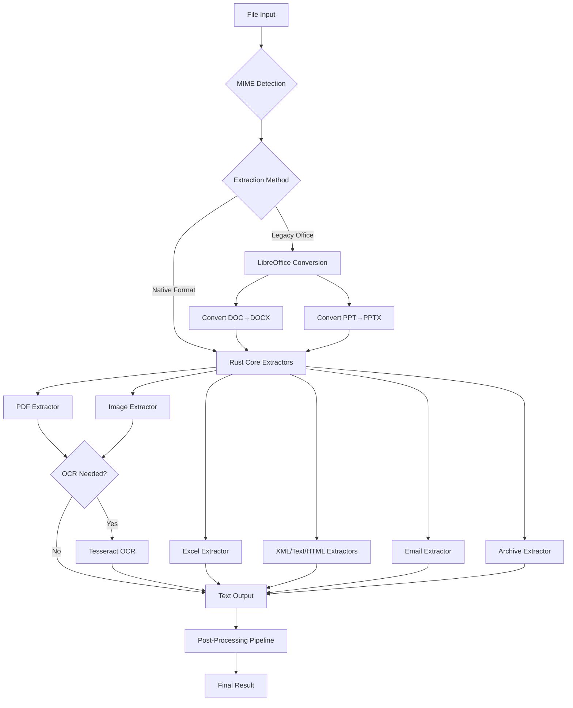

# Format Support

Kreuzberg supports 75+ file formats across major categories, providing comprehensive document intelligence capabilities through native Rust extractors and LibreOffice conversion.

## Overview

Kreuzberg v4 uses a high-performance Rust core with two extraction methods:

- **Native Rust Extractors**: Fast, memory-efficient extractors for common formats
- **LibreOffice Conversion**: Legacy Microsoft Office format support (`.doc`, `.ppt`)

All formats support async/await and batch processing. Image formats and PDFs support optional OCR when configured.

## Format Support Matrix

### Office Documents

| Format | Extensions | MIME Type | Extraction Method | OCR Support | Special Features |
|--------|-----------|-----------|-------------------|-------------|------------------|
| PDF | `.pdf` | `application/pdf` | Native Rust (pdfium-render) | Yes | Metadata extraction, image extraction, text layer detection |
| Excel | `.xlsx`, `.xlsm`, `.xlsb`, `.xls`, `.xlam`, `.xla`, `.ods` | Various Excel MIME types | Native Rust (calamine) | No | Multi-sheet support, formula preservation |
| PowerPoint | `.pptx`, `.pptm`, `.ppsx` | `application/vnd.openxmlformats-officedocument.presentationml.presentation` | Native Rust (roxmltree) | Yes (for embedded images) | Slide extraction, image OCR, table detection |
| Word (Modern) | `.docx` | `application/vnd.openxmlformats-officedocument.wordprocessingml.document` | Native Rust | No | Preserves formatting, extracts metadata |
| Word (Legacy) | `.doc` | `application/msword` | LibreOffice conversion | No | Converts to DOCX then extracts |
| PowerPoint (Legacy) | `.ppt` | `application/vnd.ms-powerpoint` | LibreOffice conversion | No | Converts to PPTX then extracts |
| OpenDocument Text | `.odt` | `application/vnd.oasis.opendocument.text` | Native Rust | No | Full OpenDocument support |
| OpenDocument Spreadsheet | `.ods` | `application/vnd.oasis.opendocument.spreadsheet` | Native Rust (calamine) | No | Multi-sheet support |

### Text & Markup

| Format | Extensions | MIME Type | Extraction Method | OCR Support | Special Features |
|--------|-----------|-----------|-------------------|-------------|------------------|
| Plain Text | `.txt` | `text/plain` | Native Rust (streaming) | No | Line/word/character counting, memory-efficient streaming |
| Markdown | `.md`, `.markdown` | `text/markdown`, `text/x-markdown` | Native Rust (streaming) | No | Header extraction, link detection, code block detection |
| HTML | `.html`, `.htm` | `text/html`, `application/xhtml+xml` | Native Rust (html-to-markdown-rs) | No | Converts to Markdown, metadata extraction |
| XML | `.xml` | `application/xml`, `text/xml` | Native Rust (quick-xml streaming) | No | Element counting, unique element tracking |
| SVG | `.svg` | `image/svg+xml` | Native Rust (XML parser) | No | Treated as XML document |
| reStructuredText | `.rst` | `text/x-rst` | Native (rst-parser) | No | Full reST syntax support |
| Org Mode | `.org` | `text/x-org` | Native (org) | No | Emacs Org mode support |
| Rich Text Format | `.rtf` | `application/rtf`, `text/rtf` | Native (rtf-parser) | No | RTF 1.x support |
| Djot | `.djot` | `text/x-djot` | Native Rust (jotdown) | No | Smart punctuation, tables, code blocks, YAML frontmatter, footnotes, math blocks |

### Structured Data

| Format | Extensions | MIME Type | Extraction Method | OCR Support | Special Features |
|--------|-----------|-----------|-------------------|-------------|------------------|
| JSON | `.json` | `application/json`, `text/json` | Native Rust (serde_json) | No | Field counting, nested structure extraction |
| YAML | `.yaml`, `.yml` | `application/x-yaml`, `text/yaml`, `text/x-yaml` | Native Rust (serde_yaml) | No | Multi-document support, field counting |
| TOML | `.toml` | `application/toml`, `text/toml` | Native Rust (toml crate) | No | Configuration file support |
| CSV | `.csv` | `text/csv` | Native Rust | No | Tabular data extraction |
| TSV | `.tsv` | `text/tab-separated-values` | Native Rust | No | Tab-separated data extraction |

### Email

| Format | Extensions | MIME Type | Extraction Method | OCR Support | Special Features |
|--------|-----------|-----------|-------------------|-------------|------------------|
| EML | `.eml` | `message/rfc822` | Native Rust (mail-parser) | No | Header extraction, attachment listing, body text, UTF-16 support |
| MSG | `.msg` | `application/vnd.ms-outlook` | Native Rust (mail-parser) | No | Outlook message support, metadata extraction |

### Images

All image formats support OCR when configured with `ocr` parameter in `ExtractionConfig`.

| Format | Extensions | MIME Type | Extraction Method | OCR Support | Special Features |
|--------|-----------|-----------|-------------------|-------------|------------------|
| PNG | `.png` | `image/png` | Native Rust (image-rs) | Yes | EXIF metadata extraction |
| JPEG | `.jpg`, `.jpeg` | `image/jpeg`, `image/jpg` | Native Rust (image-rs) | Yes | EXIF metadata extraction |
| WebP | `.webp` | `image/webp` | Native Rust (image-rs) | Yes | Modern format support |
| BMP | `.bmp` | `image/bmp`, `image/x-bmp`, `image/x-ms-bmp` | Native Rust (image-rs) | Yes | Uncompressed format |
| TIFF | `.tiff`, `.tif` | `image/tiff`, `image/x-tiff` | Native Rust (image-rs) | Yes | Multi-page support |
| GIF | `.gif` | `image/gif` | Native Rust (image-rs) | Yes | Animation frame extraction |
| JPEG 2000 | `.jp2`, `.jpx`, `.jpm`, `.mj2` | `image/jp2`, `image/jpx`, `image/jpm`, `image/mj2` | Native Rust (hayro-jpeg2000) | Yes | OCR: Pure Rust, memory-safe decoder for JP2 container and J2K codestream formats, table detection, format-specific metadata |
| JBIG2 | `.jbig2`, `.jb2` | `image/x-jbig2` | Native Rust (hayro-jbig2) | Yes | OCR: Pure Rust bi-level decoder, commonly found in scanned PDFs |
| PNM Family | `.pnm`, `.pbm`, `.pgm`, `.ppm` | `image/x-portable-anymap`, etc. | Native Rust (image-rs) | Yes | NetPBM formats |

### Archives

| Format | Extensions | MIME Type | Extraction Method | OCR Support | Special Features |
|--------|-----------|-----------|-------------------|-------------|------------------|
| ZIP | `.zip` | `application/zip`, `application/x-zip-compressed` | Native Rust (zip crate) | No | File listing, text content extraction |
| TAR | `.tar`, `.tgz` | `application/x-tar`, `application/tar`, `application/x-gtar`, `application/x-ustar` | Native Rust (tar crate) | No | Unix archive support, gzip compression detection |
| 7-Zip | `.7z` | `application/x-7z-compressed` | Native Rust (sevenz-rust) | No | High compression format support |
| Gzip | `.gz` | `application/gzip`, `application/x-gzip` | Native Rust (flate2) | No | Gzip decompression with text extraction |

### Academic & Publishing (Native)

| Format | Extensions | MIME Type | Extraction Method | OCR Support | Special Features |
|--------|-----------|-----------|-------------------|-------------|------------------|
| LaTeX | `.tex`, `.latex` | `application/x-latex`, `text/x-tex` | Native (manual parser) | No | Full LaTeX document support |
| EPUB | `.epub` | `application/epub+zip` | Native (zip + roxmltree + html-to-markdown-rs) | No | E-book format, metadata extraction |
| BibTeX | `.bib` | `application/x-bibtex`, `application/x-biblatex` | Native (biblatex) | No | Bibliography database support |
| Typst | `.typst`, `.typ` | `application/x-typst` | Native (typst-syntax) | No | Modern typesetting format |
| Jupyter Notebook | `.ipynb` | `application/x-ipynb+json` | Native (JSON parsing) | No | Code cells, markdown cells, output extraction |
| FictionBook | `.fb2` | `application/x-fictionbook+xml` | Native (fb2) | No | XML-based e-book format |
| DocBook | `.docbook`, `.dbk` | `application/docbook+xml` | Native (roxmltree) | No | Technical documentation format |
| JATS | `.jats` | `application/x-jats+xml` | Native (roxmltree) | No | Journal article XML format |
| OPML | `.opml` | `application/x-opml+xml` | Native (roxmltree) | No | Outline format |
| RIS | `.ris` | `application/x-research-info-systems` | Native (biblib) | No | Structured citation parsing with title, authors, DOI, and abstract extraction |
| EndNote XML | `.enw` | `application/x-endnote+xml` | Native (biblib) | No | Structured citation parsing with title, authors, DOI, and keywords extraction |
| PubMed/MEDLINE | `.nbib` | `application/x-pubmed` | Native (biblib) | No | Structured citation parsing with author affiliations, MeSH terms, and abstract |
| CSL JSON | `.csl` | `application/csl+json` | Native (JSON parser) | No | Citation Style Language JSON |

### Markdown Variants (Native)

| Format | MIME Type | Extraction Method | Special Features |
|--------|-----------|-------------------|------------------|
| CommonMark | `text/x-commonmark` | Native (pulldown-cmark) | Standard Markdown spec |
| GitHub Flavored Markdown | `text/x-gfm` | Native (pulldown-cmark) | GFM extensions (tables, strikethrough, etc.) |
| MultiMarkdown | `text/x-multimarkdown` | Native (pulldown-cmark) | MMD extensions |
| Markdown Extra | `text/x-markdown-extra` | Native (pulldown-cmark) | PHP Markdown Extra extensions |
| Djot | `text/x-djot` | Native (jotdown) | Djot markup format with extended features |

### Other Formats

| Format | MIME Type | Extraction Method | Special Features |
|--------|-----------|-------------------|------------------|
| Man Pages | `text/x-mdoc` | Native (mdoc-parser) | Unix manual page format |
| Troff | `text/troff` | Native (troff-parser) | Unix document format |
| POD | `text/x-pod` | Native (pod-parser) | Perl documentation format |
| DokuWiki | `text/x-dokuwiki` | Native (dokuwiki-parser) | Wiki markup format |

## Architecture Diagram



## Feature Flags

Kreuzberg uses Cargo feature flags to enable optional format support:

| Feature Flag | Formats Enabled | Default |
|-------------|----------------|---------|
| `pdf` | PDF documents | No |
| `excel` | Excel spreadsheets (all variants) | No |
| `office` | PowerPoint and Office formats | No |
| `ocr` | OCR for images and PDFs | No |
| `email` | EML, MSG email formats | No |
| `html` | HTML to Markdown conversion | No |
| `xml` | XML document parsing | No |
| `archives` | ZIP, TAR, 7z archive support | No |

**Note:** No features are enabled by default (`default = []`). You must explicitly enable the features you need.

To enable specific features:

```toml title="Cargo.toml"
[dependencies]
# Enable only PDF and Excel format support
kreuzberg = { version = "4.0", features = ["pdf", "excel"] }
```

To enable all features with `--all-features`:

```bash title="Terminal"
# Build with all format extraction features enabled
cargo build --all-features
```

Or use the convenience bundles:

```toml title="Cargo.toml"
[dependencies]
# All format extraction features (no server components)
kreuzberg = { version = "4.0", features = ["full"] }

# Server features (API, MCP) with common format support
kreuzberg = { version = "4.0", features = ["server"] }

# CLI features with commonly used formats
kreuzberg = { version = "4.0", features = ["cli"] }
```

## System Dependencies

Some formats require external system tools:

### Tesseract OCR (Optional)

Required for OCR on images and PDFs:

```bash title="Terminal"
# Install Tesseract OCR on macOS
brew install tesseract

# Install Tesseract OCR on Ubuntu/Debian
sudo apt-get install tesseract-ocr

# Install Tesseract OCR on RHEL/CentOS/Fedora
sudo dnf install tesseract

# Install Tesseract OCR on Windows (using Scoop)
scoop install tesseract
```


### LibreOffice (Optional)

Required for legacy Microsoft Office formats (`.doc`, `.ppt`):

```bash title="Terminal"
# Install LibreOffice on macOS
brew install libreoffice

# Install LibreOffice on Ubuntu/Debian
sudo apt-get install libreoffice

# Install LibreOffice on RHEL/CentOS/Fedora
sudo dnf install libreoffice

# Windows: Download from https://www.libreoffice.org/download/
```

**Docker Note**: All system dependencies are pre-installed in official Kreuzberg Docker images.

## Format Detection

Kreuzberg automatically detects file formats using:

1. **File Extension Mapping**: 75+ formats mapped to MIME types
2. **mime_guess Crate**: Fallback for unknown extensions
3. **Manual Override**: Explicit MIME type can be provided

Example with manual override:

=== "C#"

    ```csharp title="format_detection.cs"
    using Kreuzberg;

    // Automatic format detection from file extension
    var result = KreuzbergClient.ExtractFileSync("document.pdf");

    // Manual MIME type override for files without extensions
    var result2 = KreuzbergClient.ExtractFileAsBytes(rawBytes, "application/pdf", null);
    ```

=== "Go"

    ```go title="format_detection.go"
    import "kreuzberg"

    // Automatic format detection from file extension
    result, err := kreuzberg.ExtractFileSync("document.pdf", nil)
    if err != nil {
        log.Fatal(err)
    }

    // Manual MIME type override for ambiguous files
    config := &kreuzberg.ExtractionConfig{}
    mimeBytes, _ := ioutil.ReadFile("document.dat")
    result2, err := kreuzberg.ExtractBytesSync(mimeBytes, "application/pdf", config)
    ```

=== "Java"

    ```java title="FormatDetection.java"
    import dev.kreuzberg.Kreuzberg;
    import dev.kreuzberg.ExtractionResult;

    // Automatic format detection from file extension
    ExtractionResult result = Kreuzberg.extractFile("document.pdf");

    // Manual MIME type override using detectMimeType for byte arrays
    String mimeType = Kreuzberg.detectMimeType(new byte[]{/* PDF header bytes */});
    ExtractionResult result2 = Kreuzberg.extractFileAsBytes(rawBytes, mimeType, null);
    ```

=== "Python"

    ```python title="format_detection.py"
    from kreuzberg import extract_file

    # Automatic format detection from file extension
    result = extract_file("document.pdf")

    # Manual MIME type override for unknown extensions
    result = extract_file("document.dat", mime_type="application/pdf")
    ```

=== "Ruby"

    ```ruby title="format_detection.rb"
    require 'kreuzberg'

    # Automatic format detection from file extension
    result = Kreuzberg.extract_file_sync('document.pdf')

    # Manual MIME type override for files with ambiguous extensions
    config = Kreuzberg::Config::Extraction.new
    result = Kreuzberg.extract_file_sync('document.dat', mime_type: 'application/pdf', config: config)
    ```

=== "Rust"

    ```rust title="format_detection.rs"
    use kreuzberg::{extract_file, ExtractionConfig};

    #[tokio::main]
    async fn main() -> kreuzberg::Result<()> {
        let config = ExtractionConfig::default();

        // Automatic format detection from file extension
        let result = extract_file("document.pdf", None, &config).await?;

        // Manual MIME type override for extensionless files
        let result = extract_file("document.dat", Some("application/pdf"), &config).await?;

        Ok(())
    }
    ```

=== "TypeScript"

    ```typescript title="format_detection.ts"
    import { extractFile } from '@kreuzberg/node';

    // Automatic format detection from file extension
    const result = await extractFile('document.pdf');

    // Manual MIME type override for files with no extension
    const result2 = await extractFile('document.dat', { mimeType: 'application/pdf' });
    ```

## OCR Support

OCR is available for:

- All image formats (PNG, JPEG, WebP, BMP, TIFF, GIF, etc.)
- PDF documents (with automatic fallback for scanned PDFs)
- Embedded images in PowerPoint presentations

### Configuration

```python title="ocr_configuration.py"
from kreuzberg import extract_file, ExtractionConfig, OcrConfig, TesseractConfig

# Configure OCR with multi-language support and custom Tesseract settings
config = ExtractionConfig(
    ocr=OcrConfig(
        tesseract_config=TesseractConfig(
            lang="eng+deu",  # Multiple languages: English and German
            psm=3,           # Page segmentation mode: Auto
            oem=1            # OCR Engine mode: LSTM neural net
        )
    ),
    force_ocr=False  # Only use OCR when native text extraction is insufficient
)

result = extract_file("scanned_document.pdf", config=config)
```

### Automatic OCR Decision

For PDFs, Kreuzberg automatically decides whether OCR is needed by analyzing native text:

- **No OCR**: Document has substantial, meaningful text (>64 non-whitespace chars, >32 chars/page average)
- **OCR Fallback**: Document appears scanned (mostly punctuation, very low alphanumeric ratio)

Override with `force_ocr=True` to always use OCR regardless of native text quality.

## Performance Characteristics

### Native Rust Extractors

- **PDF**: Significantly faster than Python libraries due to native Rust implementation
- **Excel**: Streaming parser, handles multi-GB files
- **XML**: Streaming parser, memory-efficient for large documents
- **Text/Markdown**: Streaming parser with lazy regex compilation
- **Archives**: Efficient extraction without full decompression

### LibreOffice Extractors

- Higher overhead (~500-2000ms per file)
- Only used for legacy formats (`.doc`, `.ppt`)
- Automatic conversion to modern formats

### Batch Processing

All formats support concurrent batch processing:

```python title="batch_processing.py"
from kreuzberg import batch_extract_file, ExtractionConfig

# Process multiple files concurrently for better throughput
paths = ["file1.pdf", "file2.docx", "file3.xlsx"]
config = ExtractionConfig(max_concurrent_extractions=8)

results = batch_extract_file(paths, config=config)
```

## Format Limitations

### Known Limitations

- **Password-Protected PDFs**: Requires `crypto` extra (`pip install kreuzberg[crypto]`)
- **Legacy Excel (.xls)**: Formula evaluation not supported (values only)
- **Encrypted Office Documents**: Password protection not supported
- **Multi-page TIFF**: OCR processes first page only (configurable)
- **Animated GIF**: Extracts first frame only

### Unsupported Formats

- Video formats (MP4, AVI, MOV, etc.)
- Audio formats (MP3, WAV, FLAC, etc.)
- CAD formats (DWG, DXF, etc.)
- Database files (MDB, ACCDB, etc.)
- Compressed Office formats without proper headers

## Adding New Formats

Kreuzberg's plugin system allows adding custom format extractors:

=== "C#"

    ```csharp title="CustomExtractor.cs"
    using Kreuzberg;
    using Kreuzberg.Plugins;

    // Custom document extractor for proprietary format support
    public class CustomExtractor : IDocumentExtractor
    {
        public string Name => "custom-format-extractor";

        public string[] SupportedMimeTypes => new[] { "application/x-custom" };

        public ExtractionResult ExtractBytes(byte[] content, string mimeType, ExtractionConfig config)
        {
            // Implement custom extraction logic for your format
            var text = ParseCustomFormat(content);
            return new ExtractionResult
            {
                Content = text,
                MimeType = mimeType,
                Metadata = new Dictionary<string, object>()
            };
        }
    }

    // Register the custom extractor with Kreuzberg
    KreuzbergClient.RegisterDocumentExtractor(new CustomExtractor());
    ```

=== "Go"

    ```go title="custom_extractor.go"
    package main

    import (
        "kreuzberg"
        "log"
    )

    // CustomExtractor implements DocumentExtractor for proprietary formats
    type CustomExtractor struct{}

    func (e *CustomExtractor) Name() string {
        return "custom-format-extractor"
    }

    func (e *CustomExtractor) SupportedMimeTypes() []string {
        return []string{"application/x-custom"}
    }

    func (e *CustomExtractor) ExtractBytes(content []byte, mimeType string, config *kreuzberg.ExtractionConfig) (*kreuzberg.ExtractionResult, error) {
        // Implement custom parsing logic for your file format
        text := parseCustomFormat(content)
        return &kreuzberg.ExtractionResult{
            Content:  text,
            MimeType: mimeType,
            Success:  true,
        }, nil
    }

    // Register the custom extractor during package initialization
    func init() {
        if err := kreuzberg.RegisterDocumentExtractor("custom-format-extractor", &CustomExtractor{}); err != nil {
            log.Fatal(err)
        }
    }
    ```

=== "Java"

    ```java title="CustomExtractor.java"
    import dev.kreuzberg.Kreuzberg;
    import dev.kreuzberg.DocumentExtractorProtocol;
    import dev.kreuzberg.ExtractionResult;
    import dev.kreuzberg.config.ExtractionConfig;

    // Custom document extractor for unsupported file formats
    public class CustomExtractor implements DocumentExtractorProtocol {
        @Override
        public String name() {
            return "custom-format-extractor";
        }

        @Override
        public String[] supportedMimeTypes() {
            return new String[]{"application/x-custom"};
        }

        @Override
        public ExtractionResult extractBytes(
            byte[] content,
            String mimeType,
            ExtractionConfig config) throws Exception {
            // Implement format-specific extraction logic
            String text = parseCustomFormat(content);
            return new ExtractionResult(text, mimeType, true, null);
        }
    }

    // Register the custom extractor
    Kreuzberg.registerDocumentExtractor(new CustomExtractor());
    ```

=== "Python"

    ```python title="custom_extractor.py"
    from kreuzberg import DocumentExtractor, ExtractionResult, Metadata

    # Custom extractor for proprietary or unsupported file formats
    class CustomExtractor(DocumentExtractor):
        def name(self) -> str:
            return "custom-format-extractor"

        def supported_mime_types(self) -> list[str]:
            return ["application/x-custom"]

        def extract_bytes(self, content: bytes, mime_type: str, config) -> ExtractionResult:
            # Implement parsing logic specific to your format
            text = parse_custom_format(content)
            return ExtractionResult(
                content=text,
                mime_type=mime_type,
                metadata=Metadata()
            )

    # Register the custom extractor with Kreuzberg's registry
    from kreuzberg import get_document_extractor_registry
    registry = get_document_extractor_registry()
    registry.register(CustomExtractor())
    ```

=== "Ruby"

    ```ruby title="custom_extractor.rb"
    require 'kreuzberg'

    # Custom document extractor for new file format support
    class CustomExtractor
      def name
        'custom-format-extractor'
      end

      def supported_mime_types
        ['application/x-custom']
      end

      def extract_bytes(content, mime_type, config)
        # Implement your custom format parsing logic
        text = parse_custom_format(content)
        Kreuzberg::Result.new(
          content: text,
          mime_type: mime_type,
          metadata: {}
        )
      end
    end

    # Register the custom extractor
    Kreuzberg.register_document_extractor(CustomExtractor.new)
    ```

=== "Rust"

    ```rust title="custom_extractor.rs"
    use kreuzberg::plugins::{DocumentExtractor, Plugin};
    use kreuzberg::types::ExtractionResult;
    use async_trait::async_trait;

    // Custom document extractor for proprietary file formats
    pub struct CustomExtractor;

    impl Plugin for CustomExtractor {
        fn name(&self) -> &str {
            "custom-format-extractor"
        }

        fn version(&self) -> String {
            "1.0.0".to_string()
        }
    }

    #[async_trait]
    impl DocumentExtractor for CustomExtractor {
        async fn extract_bytes(
            &self,
            content: &[u8],
            mime_type: &str,
            config: &ExtractionConfig,
        ) -> kreuzberg::Result<ExtractionResult> {
            // Implement format-specific parsing logic
            let text = parse_custom_format(content)?;
            Ok(ExtractionResult {
                content: text,
                mime_type: mime_type.to_string(),
                ..Default::default()
            })
        }

        fn supported_mime_types(&self) -> &[&str] {
            &["application/x-custom"]
        }
    }

    // Register the custom extractor with Kreuzberg's plugin registry
    use kreuzberg::plugins::registry::get_document_extractor_registry;
    use std::sync::Arc;

    let registry = get_document_extractor_registry();
    registry.write().unwrap().register(Arc::new(CustomExtractor))?;
    ```

=== "TypeScript"

    ```typescript title="custom_extractor.ts"
    import { registerDocumentExtractor, type DocumentExtractorProtocol } from '@kreuzberg/node';

    // Custom document extractor for new or proprietary file formats
    class CustomExtractor implements DocumentExtractorProtocol {
        name(): string {
            return "custom-format-extractor";
        }

        supportedMimeTypes(): string[] {
            return ["application/x-custom"];
        }

        async extractBytes(content: Uint8Array, mimeType: string, config?: ExtractionConfig): Promise<ExtractionResult> {
            // Implement custom parsing logic for your format
            const text = parseCustomFormat(content);
            return {
                content: text,
                mimeType: mimeType,
                success: true,
                metadata: {}
            };
        }
    }

    // Register the custom extractor
    registerDocumentExtractor(new CustomExtractor());
    ```

## See Also

- [Configuration Reference](configuration.md) - Detailed configuration options
- [Extraction Guide](../guides/extraction.md) - Extraction examples
- [OCR Guide](../guides/ocr.md) - OCR configuration and usage
- [Plugin System](../concepts/plugin-system.md) - Custom extractor development
